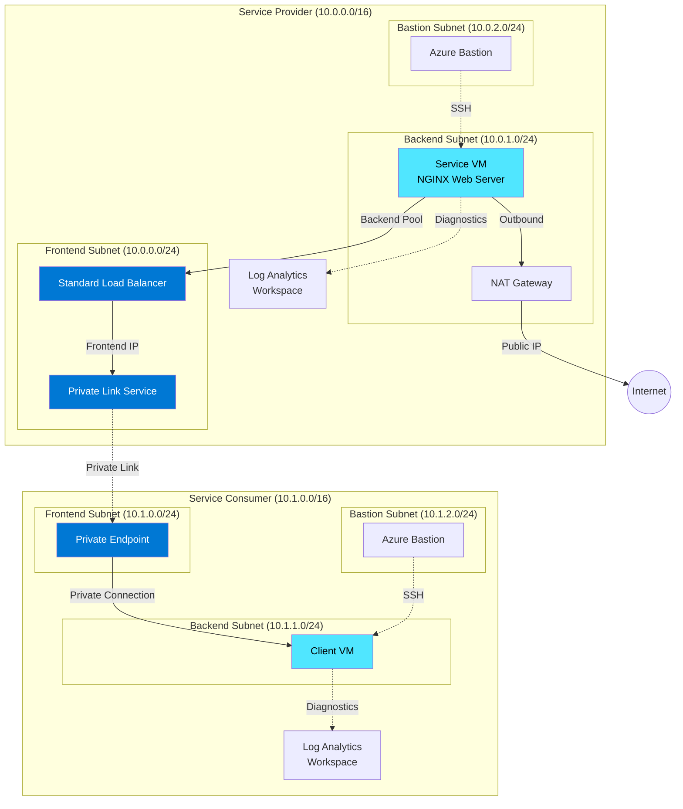

# Create a Private Link Service using Bicep

This sample demonstrates how to use [Bicep](https://docs.microsoft.com/en-us/azure/azure-resource-manager/bicep/overview) to deploy an [Azure Private Link Service](https://docs.microsoft.com/en-us/azure/private-link/private-link-service-overview) that can be accessed by consumers via an [Azure Private Endpoint](https://docs.microsoft.com/en-us/azure/private-link/private-endpoint-overview). 

The Bicep modules deploy all Azure resources in the same resource group within the same Azure subscription. In a real-world scenario, service consumer and service provider resources would typically be hosted in distinct Azure subscriptions under the same or different Microsoft Entra ID tenants.

## Prerequisites

- An active [Azure subscription](https://docs.microsoft.com/en-us/azure/guides/developer/azure-developer-guide#understanding-accounts-subscriptions-and-billing). If you don't have one, create a [free Azure account](https://azure.microsoft.com/free/) before you begin.
- [Visual Studio Code](https://code.visualstudio.com/) installed on one of the [supported platforms](https://code.visualstudio.com/docs/supporting/requirements#_platforms) along with the [Bicep extension](https://marketplace.visualstudio.com/items?itemName=ms-azuretools.vscode-bicep).

## Architecture

The following diagram shows the high-level architecture created by the [Bicep](https://docs.microsoft.com/en-us/azure/azure-resource-manager/bicep/overview) modules included in this sample:



Multiple Azure resources are defined in the Bicep modules:

- [Microsoft.Network/virtualNetworks](https://docs.microsoft.com/en-us/azure/templates/microsoft.network/virtualnetworks): Two virtual networks are deployed - one for the service provider and one for the service consumer.
- [Microsoft.Network/loadBalancers](https://docs.microsoft.com/en-us/azure/templates/microsoft.network/loadBalancers): An internal Standard Load Balancer that exposes the virtual machine hosting the service.
- [Microsoft.Network/networkInterfaces](https://docs.microsoft.com/en-us/azure/templates/microsoft.network/networkinterfaces): Network interfaces for both the service provider and service consumer virtual machines.
- [Microsoft.Compute/virtualMachines](https://docs.microsoft.com/en-us/azure/templates/microsoft.compute/virtualmachines): Two virtual machines - one hosting the service (with NGINX) and one for testing the connection via the Private Endpoint. By default, Ubuntu Linux virtual machines are deployed.
- [Microsoft.Network/bastionHosts](https://docs.microsoft.com/en-us/azure/templates/microsoft.network/bastionhosts): A separate Azure Bastion is deployed in each virtual network to provide secure SSH connectivity to the virtual machines.
- [Microsoft.Compute/virtualMachines/extensions](https://docs.microsoft.com/en-us/azure/templates/Microsoft.Compute/virtualMachines/extensions): 
  - [Azure Custom Script Extension](https://docs.microsoft.com/en-us/azure/virtual-machines/extensions/custom-script-linux) on the service provider VM to install NGINX web server
  - [Log Analytics virtual machine extension for Linux](https://docs.microsoft.com/en-us/azure/virtual-machines/extensions/oms-linux) on both VMs to collect diagnostics
- [Microsoft.OperationalInsights/workspaces](https://docs.microsoft.com/en-us/azure/templates/microsoft.operationalinsights/workspaces): Separate [Azure Log Analytics](https://docs.microsoft.com/en-us/azure/azure-monitor/logs/log-analytics-workspace-overview) workspaces for service provider and consumer to collect diagnostics logs and metrics.
- [Microsoft.Network/privateLinkServices](https://docs.microsoft.com/en-us/azure/templates/microsoft.network/privateLinkServices): The [Azure Private Link Service](https://docs.microsoft.com/en-us/azure/private-link/private-link-service-overview) that exposes the service hosted by the NGINX web server.
- [Microsoft.Network/natGateways](https://docs.microsoft.com/en-us/azure/templates/microsoft.network/natgateways?tabs=bicep): A [Virtual Network NAT](https://docs.microsoft.com/en-us/azure/virtual-network/nat-gateway/nat-overview) is created and associated with the backend subnet hosting the service provider virtual machine to provide outbound connectivity without public IP addresses.
- [Microsoft.Network/publicIpAddresses](https://docs.microsoft.com/en-us/azure/templates/microsoft.network/publicIpAddresses): Standard Public IP Addresses for Azure Bastion Hosts and the NAT Gateway.
- [Microsoft.Network/privateEndpoints](https://docs.microsoft.com/en-us/azure/templates/microsoft.network/privateendpoints): The [Azure Private Endpoint](https://docs.microsoft.com/en-us/azure/private-link/private-endpoint-overview) used to privately access the service via Azure Private Link.
- [Microsoft.Network/networkSecurityGroups](https://docs.microsoft.com/en-us/azure/templates/microsoft.network/networksecuritygroups?tabs=bicep): [Azure Network Security Groups](https://docs.microsoft.com/en-us/azure/virtual-network/network-security-groups-overview) protect subnets hosting virtual machines and Azure Bastion Hosts.

## Deploy the Bicep modules

You can deploy the Bicep modules in the `bicep` folder using Azure CLI or Azure PowerShell.

### Azure CLI

```azurecli
az group create \
  --name PrivateLinkRG \
  --location eastus

az deployment group create \
  --resource-group PrivateLinkRG \
  --template-file bicep/main.bicep \
  --parameters vmAdminUsername=azadmin vmAdminPasswordOrKey='<your-secure-password>'
```

### Azure PowerShell

```azurepowershell
New-AzResourceGroup -Name PrivateLinkRG -Location eastus

New-AzResourceGroupDeployment `
  -ResourceGroupName PrivateLinkRG `
  -TemplateFile ./bicep/main.bicep `
  -vmAdminUsername azadmin `
  -vmAdminPasswordOrKey '<your-secure-password>'
```

### Deployment Parameters

Key parameters you can customize during deployment:

- `prefix`: Prefix for all Azure resources (default: generated from resource group ID)
- `location`: Azure region for resources (default: resource group location)
- `enableBastion`: Enable/disable Azure Bastion deployment (default: true)
- `enableNsg`: Enable/disable Network Security Groups (default: true)
- `vmAdminUsername`: Administrator username for virtual machines (required)
- `vmAdminPasswordOrKey`: Password or SSH public key for VM authentication (required, secure parameter)
- `authenticationType`: Authentication type - `password` or `sshPublicKey` (default: password)

> **IMPORTANT**  
> For production deployments, use SSH key authentication and store secrets in Azure Key Vault. See [Use Azure Key Vault to pass secure parameter value during Bicep deployment](https://docs.microsoft.com/en-us/azure/azure-resource-manager/bicep/key-vault-parameter?tabs=azure-cli).

## Testing the Deployment

### Review Deployed Resources

Use the Azure portal, Azure CLI, or Azure PowerShell to list the deployed resources in the resource group.

#### Azure CLI

```azurecli
az resource list --resource-group PrivateLinkRG --output table
```

#### Azure PowerShell

```azurepowershell
Get-AzResource -ResourceGroupName PrivateLinkRG | Format-Table
```

### Connect to the Service Consumer VM

Connect to the service consumer virtual machine via Azure Bastion:

1. Navigate to the Azure portal and locate your client virtual machine (e.g., `<prefix>ClientVm`)
2. Select **Connect** on the **Overview** page
3. Select **Bastion** from the drop-down list
4. Enter your **Username**, **Authentication Type**, and **Password** or **SSH Private Key**
5. Click the **Connect** button

### Test Private Link Connection

Once connected to the client VM, test the private connection to the service:

1. Get the private IP address of the Private Endpoint:
   - In the Azure portal, navigate to the Private Endpoint resource (e.g., `<prefix>PrivateLinkServicePrivateEndpoint`)
   - Note the **Private IP address** from the **Overview** page

2. Test the connection using curl:
   ```bash
   curl <private-ip-address>
   ```

If successful, you should see a response from the NGINX web server running on the service provider VM:

```
Hello World from host <prefix>ServiceVm !
```

This confirms that the client VM can successfully access the service through the Private Link Service via the Private Endpoint.

## Clean Up Resources

When you no longer need the resources, delete the resource group to remove all deployed resources.

### Azure CLI

```azurecli
az group delete --name PrivateLinkRG --yes --no-wait
```

### Azure PowerShell

```azurepowershell
Remove-AzResourceGroup -Name PrivateLinkRG -Force
```

## What is Bicep?

[Bicep](https://docs.microsoft.com/en-us/azure/azure-resource-manager/bicep/overview) is a domain-specific language (DSL) that uses declarative syntax to deploy Azure resources. It provides concise syntax, reliable type safety, and support for code reuse. Bicep offers the best authoring experience for your infrastructure-as-code solutions in Azure.

## What is Azure Private Link Service?

[Azure Private Link Service](https://docs.microsoft.com/en-us/azure/private-link/private-link-service-overview) enables you to expose your own service, running behind an [Azure Standard Load Balancer](https://docs.microsoft.com/en-us/azure/load-balancer/load-balancer-overview), for Private Link access. Consumers of your service can create a private endpoint in their virtual network to access the service privately and securely.

### Key Benefits

- **Private Connectivity**: Eliminates exposure to the public internet
- **Cross-Tenant Access**: Service can be consumed from different Azure subscriptions and Microsoft Entra ID tenants
- **Global Reach**: Private Endpoints can be created in any Azure region to access your service
- **Standard Load Balancer Integration**: Works with Azure Standard Load Balancer for high availability and scale

### Workflow

The private link connection workflow involves:

1. **Service Provider**: Creates a Private Link Service behind a Standard Load Balancer
2. **Service Provider**: Shares the service alias or resource URI with consumers
3. **Service Consumer**: Creates a Private Endpoint in their virtual network
4. **Service Consumer**: Connects the Private Endpoint to the Private Link Service
5. **Service Provider**: Approves or rejects the Private Endpoint connection (if auto-approval not configured)
6. **Service Consumer**: Accesses the service privately through the Private Endpoint

> **NOTE**  
> In this sample, the user deploying the solution has `Owner` or `Contributor` role on the resource group, so the private endpoint connection is automatically approved. In a real-world cross-subscription or cross-tenant scenario, the service provider would need to explicitly approve the connection request.

## Limitations

The following are known limitations when using Azure Private Link Service:

- Supported only on Standard Load Balancer (not Basic Load Balancer)
- Standard Load Balancer backend pool must be configured with NIC-based targets when using VMs/VMSS
- Supports IPv4 traffic only
- Supports TCP and UDP traffic only

## Next Steps

- [Create a private link service using Azure PowerShell](https://docs.microsoft.com/en-us/azure/private-link/create-private-link-service-powershell)
- [Create a private link service using Azure CLI](https://docs.microsoft.com/en-us/azure/private-link/create-private-link-service-cli)
- [Azure Private Link documentation](https://docs.microsoft.com/en-us/azure/private-link/)
- [Bicep documentation](https://docs.microsoft.com/en-us/azure/azure-resource-manager/bicep/)
